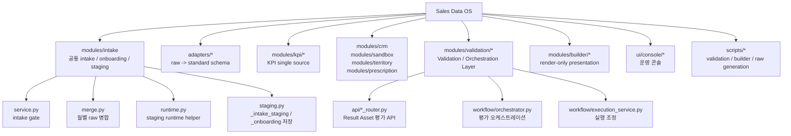
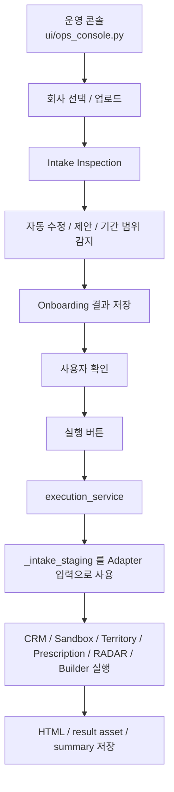
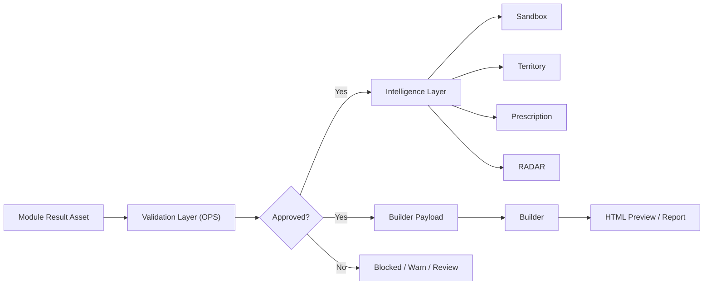
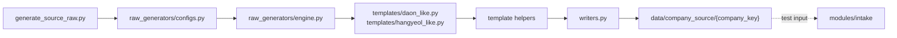
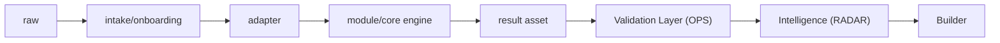

# Sales Data OS Diagram

작성일: 2026-03-22

이 문서는 현재 저장소 기준의 Sales Data OS 구조를 mermaid에 바로 넣을 수 있는 다이어그램 형태로 정리한 문서다.

중요 원칙:

- 시스템 전체 이름은 `Sales Data OS`
- `OPS`는 시스템 전체가 아니라 `Validation / Orchestration Layer`
- 실제 현재 입력 흐름은 `raw -> intake/onboarding -> adapter -> module/core engine -> result asset -> Validation Layer(OPS) -> Intelligence(RADAR) -> Builder`
- Validation 기본 패키지는 현재 `modules/validation/*`
- Builder는 `render-only`다

---

## 1. End-to-End Flow

```mermaid
flowchart LR
    subgraph DL["Data Layer"]
        R1["CRM raw"]
        R2["Sales raw"]
        R3["Target raw"]
        R4["Prescription raw"]
        R5["Master raw"]
    end

    subgraph IL["Intake / Onboarding Layer"]
        I1["Upload / Existing Source"]
        I2["Common Intake Engine<br/>modules/intake"]
        I3["_intake_staging"]
        I4["_onboarding"]
    end

    subgraph AL["Adapter Layer"]
        A1["CRM Adapter"]
        A2["Sales Adapter"]
        A3["Target Adapter"]
        A4["Prescription Adapter"]
        A5["Master Adapter"]
    end

    subgraph CL["Module / Core Engine Layer"]
        C1["CRM KPI Engine"]
        C2["Sandbox KPI Engine"]
        C3["Territory KPI Engine"]
        C4["Prescription KPI Engine"]
        C5["CRM Service"]
        C6["Sandbox Service"]
        C7["Territory Service"]
        C8["Prescription Service"]
    end

    subgraph RL["Result Asset Layer"]
        RA1["crm_result_asset"]
        RA2["sandbox_result_asset"]
        RA3["territory_result_asset"]
        RA4["prescription_result_asset"]
    end

    subgraph VL["Validation / Orchestration Layer (OPS)"]
        V1["Quality Validation"]
        V2["Mapping Validation"]
        V3["Pipeline Orchestration"]
        V4["Execution Service<br/>modules/validation/workflow"]
    end

    subgraph INL["Intelligence Layer"]
        N1["Sandbox Analysis"]
        N2["Territory Analysis"]
        N3["Prescription Analysis"]
        N4["RADAR"]
    end

    subgraph PL["Presentation Layer"]
        P1["Builder Payload"]
        P2["Builder<br/>render-only"]
        P3["HTML Preview / Report"]
    end

    R1 --> I1
    R2 --> I1
    R3 --> I1
    R4 --> I1
    R5 --> I1

    I1 --> I2
    I2 --> I3
    I2 --> I4

    I3 --> A1
    I3 --> A2
    I3 --> A3
    I3 --> A4
    I3 --> A5

    A1 --> C1 --> C5 --> RA1
    A2 --> C2 --> C6 --> RA2
    A3 --> C2
    A4 --> C4 --> C8 --> RA4
    A5 --> C3 --> C7 --> RA3

    RA1 --> V1
    RA2 --> V1
    RA3 --> V1
    RA4 --> V1

    V1 --> V2 --> V3 --> V4

    V4 --> N1
    V4 --> N2
    V4 --> N3
    V4 --> N4

    N1 --> P1
    N2 --> P1
    N3 --> P1
    N4 --> P1

    P1 --> P2 --> P3
```

---

## 2. Current Package Map

---

## 3. Console Runtime Flow

---

## 4. Validation and Intelligence Boundary

---

## 5. Raw Generator Position

테스트용 raw 생성기는 운영 입구와 분리해서 본다.

---

## 6. One-Line Summary

---

## 7. Diagram Reading Rule

이 다이어그램은 아래 해석으로 읽는다.

- `modules/intake`는 실제 운영 입력 정리 계층이다.
- `modules/validation`은 OPS의 현재 기본 구현 패키지다.
- KPI 계산은 `modules/kpi/*`가 단일 소스다.
- Sandbox / Territory / Prescription / RADAR는 Intelligence Layer 해석 계층이다.
- Builder는 계산 계층이 아니라 표현 계층이다.

즉 현재 Sales Data OS는 단순한 대시보드가 아니라,
`입력 정리 -> 표준화 -> 계산 -> 검증 -> 해석 -> 표현`이 연결된 운영 구조로 본다.
