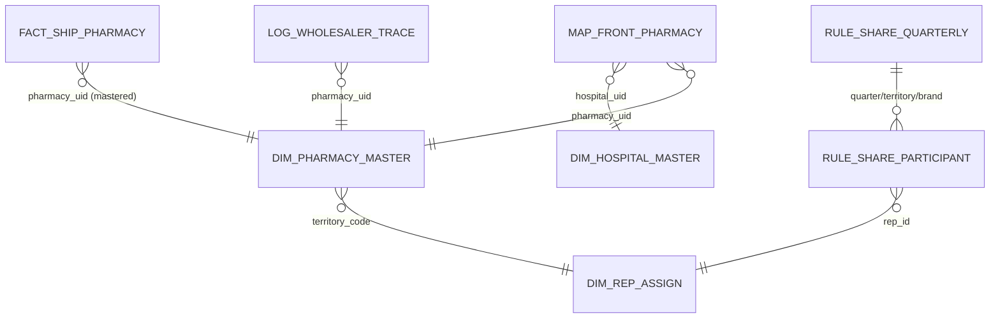

# Data Model & ERD — Prescription Data Flow (MVP)

## 1) 관계 요약
- FACT_SHIP_PHARMACY → DIM_PHARMACY_MASTER: 약국 정규화 및 territory_code 획득
- DIM_REP_ASSIGN: rep의 territory 귀속(트래킹 시작 이후만 적용)
- RULE_SHARE_QUARTERLY(+PARTICIPANT): 분기×권역×브랜드 단위 쉐어 정의
- MAP_FRONT_PHARMACY: 병원-문전약국 제출/승인(정산 핵심은 territory 기반이지만 Claim/운영 근거)
- LOG_WHOLESALER_TRACE: 미포착 루프(도매 확인 → 매핑 개선)

## 2) Mermaid ERD

## 3) 키/그레인 원칙

정산 핵심 그레인: year_quarter × territory_code × brand × rep_id

룰 그레인: year_quarter × territory_code × brand (+ version)

약국 UID: 거래처ID 있으면 우선, 없으면 (name+addr+tel) 기반 생성

---

